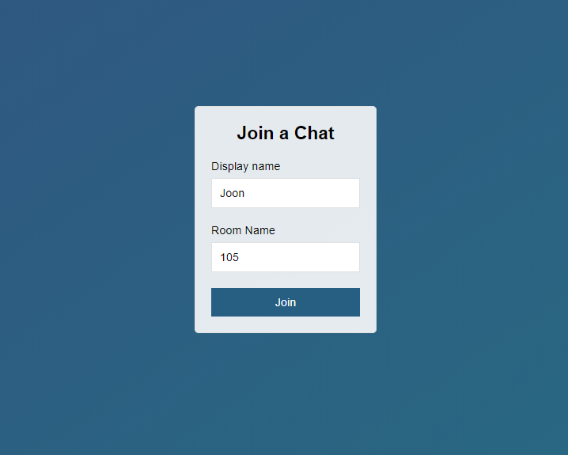
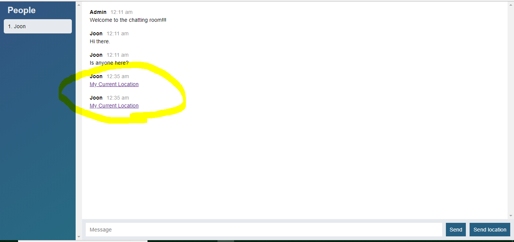
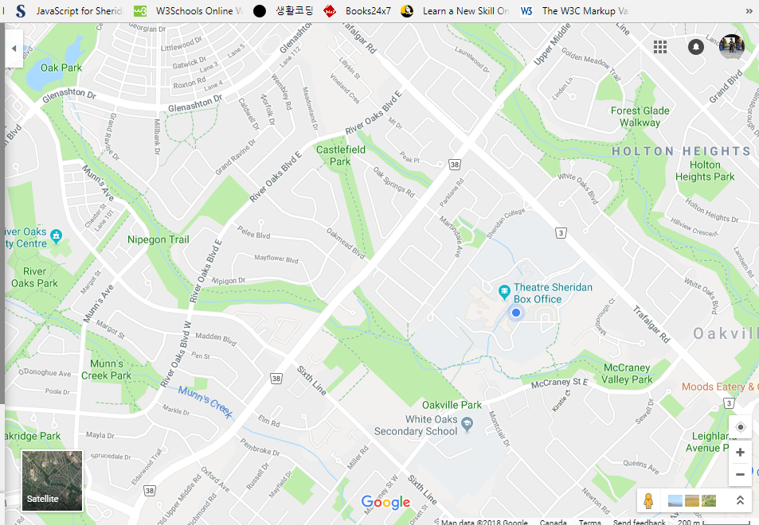
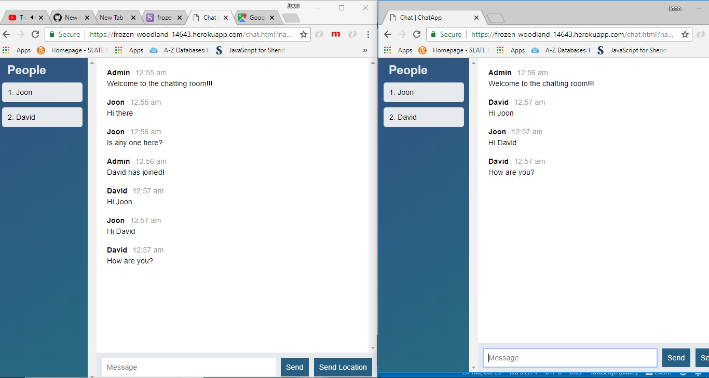

# Chatting App

## Main Programming Language: node (socketio, mocha)

## App Structure :
#### Server and Client to mutually communicate
####
## Main Page
#### - taking user name / id that shows up in the user lists
#### - chatting room generating network socket interface
##### 
####
#### 1. Server
####      - listening data from clients over http
####      - customizing the format of the clients' messages and time information deployed by "moment" lib, not Date object
####      - displaying Location information with GoogleMap by taking advantage of Geolocation 
####      - and implementing on/emit methods and their preset callback(s) in socketio module
##### 
##### 
####
#### 2. Client
####      - listening data from the server and rendering messages / data to a browser by utilizing mustache lib
##### 

